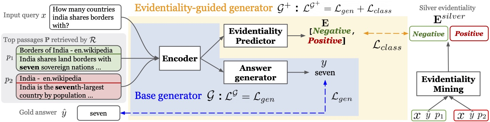

# Evidentiality-guided Generator
This is the official implementation of the following paper: Akari Asai, Matt Gardner and Hannaneh Hajishirzi. [Evidentiality-guided Generation for Knowledge-Intensive NLP Tasks](https://akariasai.github.io/files/evidentiality_arxiv_2021.pdf). Preprint. 2021. 

In this paper, we introduce **Evidentiality-guided GGenerator**, which incorporates evidentiality of passages---whether a passage contains correct evidence to support the output---into training the generator via multi-task learning of answer generation and evidentiality prediction for retrieval-augmented generation. Experimental results show large improvements across three knowledge intensive tasks: open question answering, fact verification and knowledge-enhanced dialogue. 


## Directories
- [`evi_gen`](evi_gen): codes for our evidentiality-guided generator model. The implementation is built upon [Fusion-in-Decoder (Izacard and Grave, 2020)](https://github.com/facebookresearch/FiD).

- [`mining`](mining): code for our evidentiality labeling model used to obtain silver evidentiality data.

Please see the training and evaluation details in each directories. 

## Data and Models
### Retrieved data (train / dev / test )
We release the DPR retrieved results and the results with our silver evidentiality labels. All of the data can be downloaded from [here](https://drive.google.com/drive/folders/1PA4NEJr3W1JXNvofJYBlTo5nyyGkMqRL?usp=sharing).      
- [`evidentiality_dpr.zip`](https://drive.google.com/file/d/1BnWMB9XS63HPRVq7eWYJ3h4JvVsfr6-5/view?usp=sharing) includes the retrieval results with our newly mined silver evidentiality labels for train sets for each target dataset. For each query, we include top 20 passages. 
- [`eval_dpr.zip`](https://drive.google.com/file/d/1fpmpjHNR0doYdYdS-1298_Jg-V8urPoK/view?usp=sharing) includes the retrieval results for dev / test sets for each target dataset. 

### Fine-tuned models
You can download the fine-tuned models from the google drive repositories. 

- [NQ Open](https://drive.google.com/file/d/16bio8wIvbIj7OmWqaiBzGFEHBFB6AlY6/view?usp=sharing)
- [TriviaQA unfiltered](https://drive.google.com/file/d/1YskriNt9LMUUZnGqSbhlE4Cyiz8CSaPG/view?usp=sharing)
- [FaVIQ unfiltered](https://drive.google.com/file/d/1OnFxXzJTWbu_rWylDmS0P8gXHMZJPGbW/view?usp=sharing)
- [FEVER unfiltered](https://drive.google.com/file/d/19qa1vr4ng_GAqGcygr5ErCuSh5fnqhpr/view?usp=sharing)
- [WoW](https://drive.google.com/file/d/10RsFfGgzsSC9MOb3Csoc1ztUp0NJSoGy/view?usp=sharing)

## Evaluations
To reproduce the original results, you can go to `evi_gen` directory and then run the command below:

```
CUDA_VISIBLE_DEVICES=0 python test_reader.py \
    --model_path model/nq_ours \
    --eval_data data/nq_test.json \
    --per_gpu_batch_size 48 \
    --n_context 20 \
    --name sanity_nq_test \
    --checkpoint_dir checkpoint \
    --n_gpus 1 \
    --write_results
```

For WoW, please set the `--metric f1`


## Training
### Overview of Training
Our evidentiality-guided generator will conduct a multi-task learning of evidentiality prediction and generation.      
To supervised this learning, we need to obtain *silver* evidentiality data.   

Our training procedures are as follows:
1. Training a base Fusion-in-Decoder model (*base generator*)
2. Run leave-one-out generation approach to collect training data for evidentiality labeling model (M) using the base generator.
3. Train M using data from step 2.
4. Run M on all of the passages included in training data for a evidentiality-guided generator to obtain silver evidentiality labels. 
5. Train the evidentiality-guided generator with the multi-task loss.

See more detailed instructions in the `evi_gen` and `ranker` directories.  

### Training our evidentiality generator
We provide the resulting training data [here](https://drive.google.com/file/d/1BnWMB9XS63HPRVq7eWYJ3h4JvVsfr6-5/view?usp=sharing).         
To train our evidentiality generator, please run the command below:

```
python train_reader.py \
    --use_checkpoint --lr 0.00005 --optim adamw \
    --scheduler linear --weight_decay 0.01 \
    --text_maxlength 250 --per_gpu_batch_size 1 \
    --n_context 2 --total_step 120000 \
    --warmup_step 1000 \
    --train_data /path/to/train/data.json \
    --eval_data /path/to/train/data.json \
    --model_size base --name /model_name/ --accumulation_steps 4 \
    --n_gpus 8 --eval_freq 5000 \
    --answer_maxlength 5
```
## Citations and Contact
Please contact Akari Asai (akari[at].cs.washington.edu) for questions or suggestions. 

If you use our data/models in your work, please cite our paper. 

```
@article{asai2021evidentiality,
  title={Evidentiality-guided Generation for Knowledge-Intensive NLP Tasks},
  author={Asai, Akari and Gardner, Matt and Hajishirzi, Hannaneh},
  journal={arXiv preprint arXiv:2112.08688},
  year={2021}
}
```